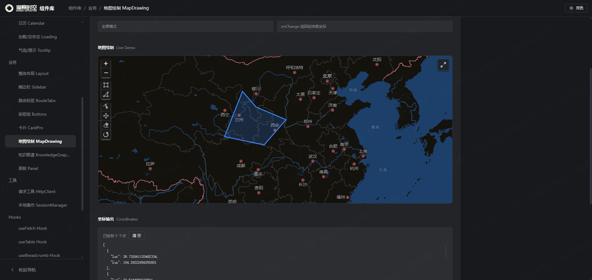

# Insightst Design

An Insightst UI component library.

## Example

## Structure

- `apps/docs`: Component documentation site (runs on port 3000)
- `apps/playground`: React playground for testing components (runs on port 3001)
- `packages/ui`: The main UI component library
- `packages/theme`: Design tokens and theme configuration
- `packages/icons`: Icon library (wrapping lucide-react)
- `packages/hooks`: Shared React hooks
- `packages/utils`: Helper functions

## Commands

- `npm run dev`: Develop and test components
- `npm run docs`: Run the component documentation site (port 3000)
- `npm run build`: Build the component packages
- `npm run clean`: Remove build artifacts

## Publishing

- `npm adduser`: Create an npm user account
- `npm install -D @changesets/cli`: Install Changesets for automated releases without manually updating version numbers
- `npx changeset init`: Initialize Changesets
- `npx changeset`: Start the versioning workflow after changing the source code
- `npx changeset version`: Update package versions
- `npm login`: Log in to npm
- `npx changeset publish`: Publish the packages to npm
